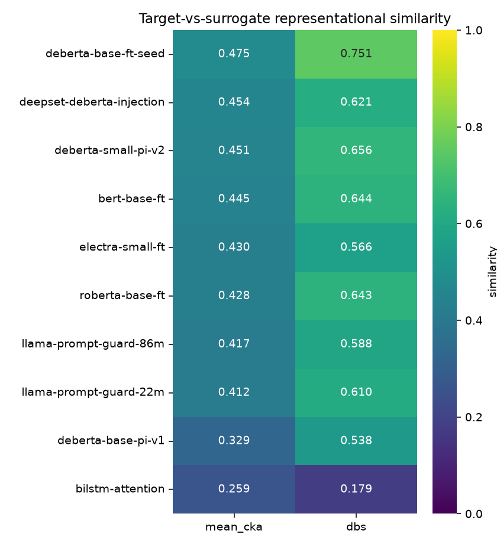

## Introduction

Prompt-injection detectors, jailbreak filters, and content gates are deployed in front of language models as if they were guarantees. They are not. @vassilev-2025 gives the negative result: for any finite checker the set of adversarial prompts that evade it is infinite, so no classifier covers it. "Is this filter safe?" has no useful answer.

A comparative question does have one: how leaky is this filter relative to others, and which models can an attacker use to craft inputs that transfer to it? @cox-bunzel-2025 make that question operational in the image domain. They select surrogate models that bracket a target in representational similarity, attack the surrogates, measure how often the attacks transfer to the target, and fit a regression that predicts transfer rate from similarity. No public, runnable implementation of that method exists, and none has been applied to text safety classifiers.

This project is the first such implementation. It reproduces the five-step pipeline against a named, deployed prompt-injection detector, with seeded and reproducible code, concrete numbers, and a clear boundary: it measures and compares leakiness; it does not certify robustness. The target is a mitigation for OWASP LLM01 (Prompt Injection), so the measurement is a relative robustness score for that control, not a guarantee about it.

## Background and related work

Three results bracket the method. @vassilev-2025 motivates measurement over certification. @cox-bunzel-2025 supplies the constructive recipe — bracket the target by representational similarity, attack surrogates, regress transfer on similarity. @klause-bunzel-2025 is the empirical predecessor that relates network similarity to attack transferability and introduces Diagonal Box Similarity (DBS); it is the source of the CNN-derived thresholds that have to be recalibrated for text.

Representational similarity is measured with linear Centered Kernel Alignment [@kornblith-2019], which compares two activation matrices in `[0, 1]`, invariant to orthogonal rotation and isotropic scaling.

The attacks are word- and character-level adversarial perturbations against text classifiers, run through TextAttack [@morris-2020]: DeepWordBug [@gao-2018] edits characters of high-saliency tokens; PWWS [@ren-2019] substitutes WordNet synonyms ordered by word saliency; TextFooler [@jin-2020] swaps counter-fitted-embedding synonyms under a semantic-similarity constraint; BAE [@garg-ramakrishnan-2020] and BERT-Attack [@li-2020] fill masked positions with a BERT masked-language model. The set spans character, lexical (WordNet and embedding), and masked-LM perturbation families.

## Method

**Probe and similarity.** A deterministic, class-balanced probe set of 2,000 prompts is tokenised to a 512-token window and passed through the target and each surrogate. For every surrogate the pipeline harvests per-layer hidden states and computes the layer-by-layer CKA matrix against the target, then reduces it to two scalars: `mean_cka`, the mean over all layer pairs, and `dbs`, the average over a band of cells around the matched-depth diagonal. CKA self-similarity, rotation invariance, and scaling invariance, and the DBS box-size edge cases, are checked as unit-test invariants.

**Selection.** Thresholds `r1` and `r2` are calibrated as the upper- and lower-quartile of the observed `mean_cka` distribution rather than copied from the image-domain paper. Surrogates with `mean_cka ≥ r1` form the high-similarity set M1; those with `mean_cka ≤ r2` form the low-similarity set M2.

**Attack and transfer.** Each surrogate is attacked with the five recipes over the held-out injection prompts it originally classifies as injections. Every adversarial example that flips its surrogate is replayed against the frozen target; the transfer rate of a `(surrogate, recipe)` cell is the fraction that also flip the target to "benign".

**Risk model and ablation.** Transfer rate is regressed on the similarity features with shallow tree models, read for feature importance rather than prediction at this sample size, with Spearman correlation as the primary trend evidence. The headline test is a direct, one-sided permutation test of M1 against M2 on the difference in group-mean transfer rate, evaluated on each surrogate's mean-across-recipes and max-across-recipes transfer. With small groups the label assignments are enumerated exactly, giving an exact p-value; three versus three surrogates have only `C(6,3) = 20` assignments, so the smallest attainable one-sided p-value is `1/20 = 0.05`, which the report states alongside the effect size.

## Data and models

Three public prompt-injection datasets are harmonised to a single `text`/`label` schema (label 1 = injection), deduplicated by normalised exact match, and checked for cross-source overlap.

| Source | Rows |
| --- | --- |
| jackhhao/jailbreak-classification | 1,286 |
| Lakera/gandalf_ignore_instructions | 999 |
| deepset/prompt-injections | 662 |
| Total (raw) | 2,968 |

Deduplication removes 21 exact duplicates and finds 0 cross-source overlaps, leaving 2,947 rows — 1,910 injection and 1,037 benign (64.8% / 35.2%) — split 80/10/10 into train, validation, and test. The test-split injections are the attack evaluation set.

The target is `protectai/deberta-v3-base-prompt-injection-v2`, a deployed DeBERTa-v3-base prompt-injection detector. The ten surrogates span the similarity range from the target's own backbone (fine-tuned by us with a different seed, as a CKA sanity anchor) down to a from-scratch BiLSTM floor.

| Surrogate | Backbone | Kind |
| --- | --- | --- |
| deberta-base-ft-seed | DeBERTa-v3-base | fine-tuned (same backbone as target) |
| deepset-deberta-injection | DeBERTa-v3-base | pretrained detector |
| deberta-small-pi-v2 | DeBERTa-v3-small | pretrained detector (gated) |
| deberta-base-pi-v1 | DeBERTa-v3-base | pretrained detector |
| bert-base-ft | BERT-base | fine-tuned |
| roberta-base-ft | RoBERTa-base | fine-tuned |
| electra-small-ft | ELECTRA-small | fine-tuned |
| llama-prompt-guard-86m | mDeBERTa-base | pretrained detector (gated) |
| llama-prompt-guard-22m | mDeBERTa-xsmall | pretrained detector (gated) |
| bilstm-attention | BiLSTM (from scratch) | non-transformer floor |

The four fine-tuned surrogates reach 0.96–0.97 validation accuracy and the BiLSTM 0.89, so each is a competent detector rather than a degenerate one; this matters because transfer is only meaningful between models that actually perform the task.

## System architecture

The implementation is a Kedro project with a deliberate split: the security-relevant mathematics (CKA, DBS, threshold calibration, deterministic seeding, the transfer-rate and permutation statistics) lives in a pure `transfer_risk.lib` package with no I/O, unit-tested in isolation against the invariants above; the nodes are thin wrappers that read inputs from a typed Data Catalog, call `lib`, and write artifacts; and the pipelines wire nodes to catalog datasets without business logic.

The models, similarity, and attack pipelines are generated from configuration: one node per surrogate (train or materialise, then export to ONNX), one CKA node per surrogate, and one attack node per `(surrogate, recipe, example-shard)`. `ParallelRunner` runs the independent nodes across cores and `kedro run --only-missing-outputs` resumes by skipping artifacts already written, so an interrupted run continues where it stopped.

Every model and dataset crosses process and machine boundaries through the catalog, not ad-hoc I/O. Pretrained surrogates, fine-tune backbones, and the target are HuggingFace Hub datasets; each trained surrogate persists through an fsspec-aware model-directory dataset, and its ONNX graph through a matching dataset; ONNX export is an in-environment `torch.onnx.export` node. A `${globals:...}` root layer points these boundary artifacts at local paths by default and at an S3 bucket under the cloud environment, via scoped resolvers — so the catalog, rather than a sync script, owns where data lives.

The attack sweep is the only expensive stage. It runs on a single high-core ARM Graviton instance provisioned by Terraform (S3 state exchange, least-privilege instance role, egress-only security group with SSM Session Manager instead of SSH, IMDSv2 required). The box reads splits, surrogate checkpoints, and ONNX graphs from S3 through the catalog, serves victim inference from ONNX Runtime, writes each cell's adversarial partition back to S3, and self-terminates; it holds no HuggingFace token and makes no Hub calls. The cheap downstream (transfer, risk, reporting) and MLflow tracking run locally, so results land on the development machine and MLflow stays a single local writer. Runs are seeded from one root seed and tracked in MLflow with the git SHA.

```{mermaid}
flowchart LR
  A["Probe set<br/>(benign + injection)"] --> B["CKA + DBS<br/>target vs each surrogate"]
  B --> C["Calibrate r1 / r2<br/>split into M1 (high) · M2 (low)"]
  C --> D["Attack each surrogate<br/>5 TextAttack recipes"]
  D --> E["Replay on frozen target<br/>→ transfer rate"]
  E --> F["Regress transfer ~ similarity<br/>+ M1-vs-M2 permutation test"]
```

The interactive pipeline graph is on the [Pipeline](pipeline.qmd) page.

## Results

### Representational similarity

CKA is computed layer-by-layer between the target and each surrogate over the 2,000-prompt probe at a 512-token window, then reduced to `mean_cka` and `dbs`.

| Surrogate | mean CKA | DBS |
| --- | --- | --- |
| deberta-base-ft-seed | 0.475 | 0.751 |
| deepset-deberta-injection | 0.454 | 0.620 |
| deberta-small-pi-v2 | 0.451 | 0.656 |
| bert-base-ft | 0.445 | 0.644 |
| electra-small-ft | 0.430 | 0.566 |
| roberta-base-ft | 0.428 | 0.643 |
| llama-prompt-guard-86m | 0.417 | 0.588 |
| llama-prompt-guard-22m | 0.412 | 0.610 |
| deberta-base-pi-v1 | 0.329 | 0.538 |
| bilstm-attention | 0.259 | 0.179 |

{width=70%}

The sanity check holds. `deberta-base-ft-seed` — the target's backbone, fine-tuned by us on the same task with a different seed — tops both `mean_cka` (0.475) and `dbs` (0.751), and the from-scratch BiLSTM floors both (0.259 and 0.179). That is the ordering expected if CKA measures representational similarity.

One result is worth stating plainly: `deberta-base-pi-v1`, a deployed detector built on the *same* DeBERTa-v3-base backbone as the target, sits near the bottom on `mean_cka` (0.329), below several different-architecture models. Sharing a backbone does not by itself produce high representational similarity once the training data and objective differ; this is why similarity has to be measured rather than assumed from architecture.

Calibrated from the `mean_cka` distribution, the thresholds are `r1 = 0.450` and `r2 = 0.413`. They split the pool into a high-similarity set M1 = {`deberta-base-ft-seed`, `deepset-deberta-injection`, `deberta-small-pi-v2`} and a low-similarity set M2 = {`llama-prompt-guard-22m`, `deberta-base-pi-v1`, `bilstm-attention`}. The selection ablation compares these two sets.

### Attack transfer and the M1-vs-M2 ablation

::: {.callout-note}
## Computing
The attack stage — ten surrogates × five recipes = 50 cells, fanned out to roughly 2,450 example-shards — runs as the cloud sweep described above. When it completes, this section reports: per-recipe surrogate attack-success rates; per-surrogate transfer rates against similarity; the Spearman correlation between `mean_cka`/`dbs` and transfer; the random-forest feature importances; the M1-vs-M2 permutation test on mean and max transfer (with the exact p-value and the small-group floor noted); and one before/after example of a single perturbation that flips both a surrogate and the frozen target. The transfer-rate-versus-similarity scatter and the selection-ablation figure are added here from the same run.
:::

## Limitations

The study covers one target and one task (prompt injection) with character, lexical, and masked-LM attacks. It does not include optimization-based suffix attacks (GCG) or multi-turn attacks, so it bounds risk against the families it runs, not all of them. The selection ablation uses three-versus-three groups, where the exact permutation p-value cannot fall below 0.05 regardless of effect size; the effect size is reported alongside it. With tens of `(surrogate, recipe)` observations the regression is read for feature importance and rank correlation, not out-of-sample prediction. The measurement is a relative leakiness score against a reference pool and a named target; it is not a certificate of robustness [@vassilev-2025].

## Future work

The surrogate layer and the attack interface are model- and category-agnostic, so the deferred extensions are configuration rather than rewrites: an LLM-judge tier (Llama Guard, Granite Guardian, ShieldGemma) attacked with optimization-based suffixes (nanoGCG); additional target categories (jailbreak, toxicity) once a detector and a clean dataset exist for each; and additional targets within prompt injection to turn the single-target leakiness score into a cross-target comparison.

## References

::: {#refs}
:::
