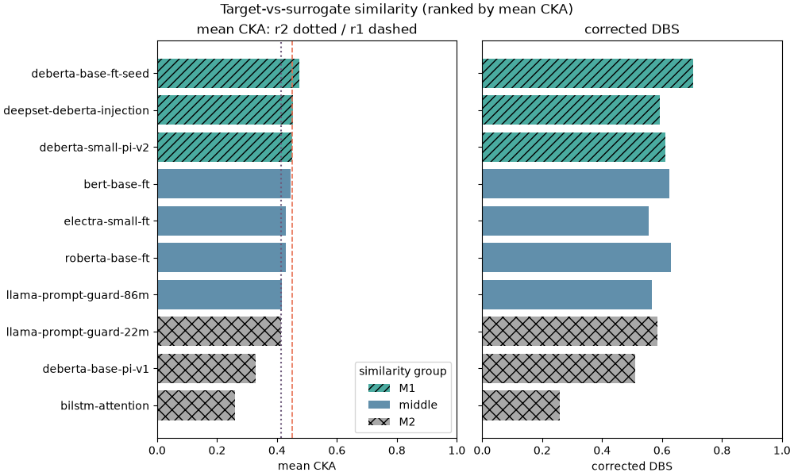
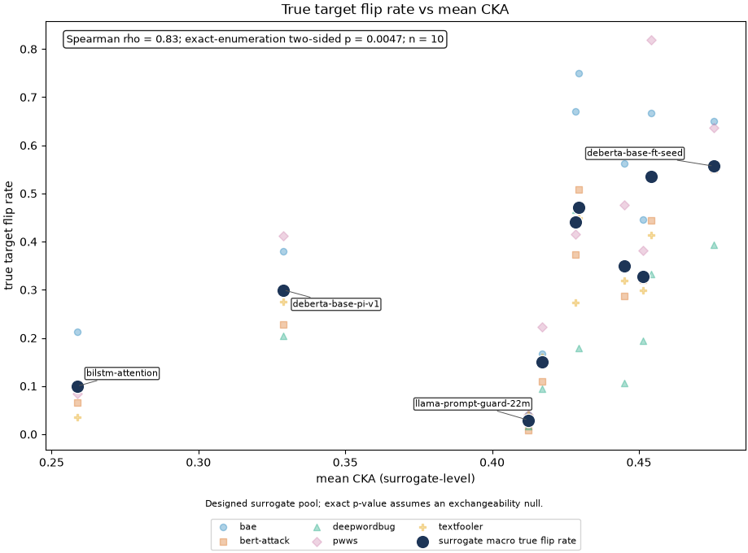
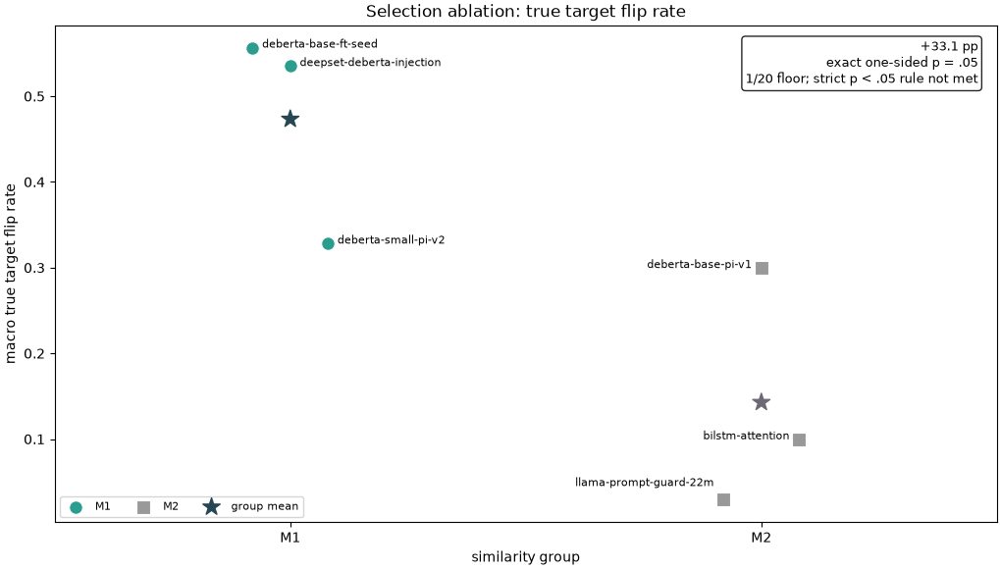

## Research question and contribution

Prompt injection remains a practical risk for systems that place untrusted text into language-model workflows [@owasp-llm01-2025]. A classifier-based detector can be attacked indirectly when an attacker develops perturbations against an accessible surrogate, then applies those perturbations to a target. This report asks a narrow question: within a fixed public surrogate pool, does higher representational similarity to a prompt-injection detector correspond to a higher rate of verified target injection-to-benign outcomes after a source attack succeeds?

The target is `protectai/deberta-v3-base-prompt-injection-v2`, a public, now-archived English prompt-injection detector [@protectai-2024]. The report adapts the CKA-guided surrogate-selection workflow proposed by Cox and Bunzel [@cox-bunzel-2025] to a text-classification setting. It combines a frozen target, ten heterogeneous surrogates, layer-wise CKA and Diagonal Box Similarity (DBS), five TextAttack recipes, target-baseline auditing, small-pool enumeration, and catalog-generated reporting artifacts.

Three contributions organize the work. First, the target audit separates a verified target injection-to-benign outcome from the earlier conditional target-benign metric. Second, the primary association aggregates recipe cells to one summary per surrogate and exposes the designed-pool assumption behind its p-value. Third, the site publishes aggregate tables and sensitivity results that permit review of the reported counts and selection membership without releasing raw attack prompts.

Vassilev derives theoretical limits for finite security controls [@vassilev-2026]. This evaluation is a transfer-risk measurement, not a robustness certification.

## Related work

Transferability is well established for neural text classifiers. Yuan et al. study how architecture, tokenization, embeddings, and capacity affect text-attack transfer, then use model ensembles to induce transferable examples [@yuan-etal-2021-transferability]. He et al. show that a query-limited extracted BERT model can supply adversarial examples that transfer to a target API, including under architecture mismatch [@he-etal-2021-model]. These studies motivate surrogate-based analysis while leaving the target outcome and surrogate-selection signal as design choices.

Hackett et al. evaluate evasion of prompt-injection and jailbreak detectors, including an experiment that uses ProtectAI v2 as a white-box source for word-importance transfer to Azure Prompt Shield [@hackett-etal-2025-bypassing]. That work evaluates named detector systems. The present study instead ranks a ten-model surrogate pool by CKA before attacks, then audits target baselines and perturbed outcomes.

Cox and Bunzel propose selecting surrogates around a target in representational-similarity space, attacking them, and estimating transferred black-box risk [@cox-bunzel-2025]. Klause and Bunzel provide the related DBS measure and empirical context for relating similarity to transferability [@klause-bunzel-2025]. Linear CKA measures alignment between activation matrices while remaining invariant to orthogonal rotation and isotropic scaling [@kornblith-2019]. Gupta et al. add a qualification: representation-space attacks need not transfer even when data-space attacks do [@gupta-etal-2025-understanding]. The attacks here operate on text inputs. CKA is a surrogate-selection signal, rather than a complete explanation of why a perturbation carries over.

Recent work continues to develop transfer-oriented text attacks. SEP-Attack uses diverse surrogate ensemble weights to select transferable textual adversarial candidates [@liu-etal-2026-sep]. This study holds five established recipes fixed because its focus is selection and audit, rather than a comparison of attack generators.

## Data and models

The canonical corpus begins with 2,968 rows from `deepset/prompt-injections`, `jackhhao/jailbreak-classification`, and `Lakera/gandalf_ignore_instructions` [@deepset-prompt-injections; @jackhhao-jailbreak-classification; @lakera-gandalf-ignore-instructions]. The sources have different schemas and task emphases. The deepset card exposes `text` and numeric `label` fields. The jackhhao card uses a prompt field and `jailbreak` or `benign` labels. Lakera supplies prompt-injection examples. The canonical positive class therefore mixes direct prompt-injection material with jailbreak-style examples.

Normalization removes 21 exact duplicates, leaving 2,947 rows: 1,910 positive and 1,037 benign. The [dataset audit](artifacts/dataset_audit.json) records post-deduplication source counts of 1,286 for jackhhao, 999 for Lakera, and 662 for deepset. Those counts sum to the final corpus, rather than the raw row count. A deterministic stratified split produces train, validation, and test partitions. The attack evaluation set contains 191 canonical positive test prompts under the mixed injection/jailbreak label.

The ProtectAI model card specifies label 0 as benign and label 1 as injection-detected, with a 512-token use pattern [@protectai-2024]. Its card lists `jackhhao/jailbreak-classification` among training sources. This evaluation uses that source too, so record-level decontamination against the target's undisclosed full training mixture was not established.

The surrogate pool contains five pretrained detectors, four locally fine-tuned transformers, and one from-scratch BiLSTM with attention. The locally fine-tuned transformers reach validation accuracy from 0.956 to 0.973. The BiLSTM reaches 0.895. Pretrained detectors retain their own training objectives and source data, so their validation values are not directly comparable to local fine-tune values. The [model validation summary](artifacts/model_validation_summary.json) exposes available metadata.

## Method

### Representation probe and selection

The original analysis samples 2,000 balanced prompts from canonical data before the train, validation, and test split. Every model receives the same prompts at a 512-token window. Transformer representations use CLS pooling from each non-embedding hidden layer. The static embedding layer is excluded because its CLS vector is constant across inputs in this setup. The BiLSTM contributes its pooled representation layers.

For target activation matrix X and surrogate activation matrix Y, linear CKA is calculated from centered cross-covariance:

$$
\operatorname{CKA}(X,Y) =
\frac{\left\lVert Y_c^\mathsf{T}X_c\right\rVert_F^2}
{\left\lVert X_c^\mathsf{T}X_c\right\rVert_F\left\lVert Y_c^\mathsf{T}Y_c\right\rVert_F}.
$$

The implementation computes every target-layer and surrogate-layer pair, then reports the matrix mean as `mean_cka`. Corrected DBS averages cells in the union of Bresenham-centered diagonal boxes. The pure implementations and their invariance tests live in [`src/transfer_risk/lib`](https://github.com/turn1a/safety-classifier-transfer-risk/tree/main/src/transfer_risk/lib).

The `mean_cka` thresholds are empirical quartiles of the same ten-surrogate pool: r1 = 0.4497818 and r2 = 0.4134581. M1 contains `deberta-base-ft-seed`, `deepset-deberta-injection`, and `deberta-small-pi-v2`. M2 contains `llama-prompt-guard-22m`, `deberta-base-pi-v1`, and `bilstm-attention`. The remaining models form the middle band. This is a descriptive split calibrated and evaluated on the same pool.

The original probe was sampled before splitting. Approximately 69% of training rows and 50% of attacked canonical positives overlap it. That overlap motivates the training-only CKA sensitivity described below. Neither probe establishes an external validation set for the surrogate-selection claim.

### Source attacks

The attack sweep evaluates ten surrogates by five recipes: DeepWordBug [@gao-2018], PWWS [@ren-2019], TextFooler [@jin-2020], BAE [@garg-ramakrishnan-2020], and BERT-Attack [@li-2020]. They run through the TextAttack framework [@morris-2020]. Every cell starts with the same 191 canonical positive prompts. This yields 50 cells and 9,550 attempted source evaluations.

TextAttack skips 950 baseline source misses. The remaining 8,600 attempts are eligible because the source surrogate initially predicts the canonical positive label. Source success is a perturbation that changes the source prediction from positive to benign. Of the eligible attempts, 4,362 source attacks succeed and 4,238 fail. The eligible source attack success rate is 50.7%. Successful-source denominators range from 6 to 161 by cell, with a median of 85.

Attacks and target evaluation use a 512-token window. The attack runner allows up to 6,000 source-victim queries per example, then records the TextAttack outcome class and perturbed text. A skipped baseline source miss is excluded before the source-success denominator is formed.

### Post-hoc target outcome audit

The initial transfer output counted target benign predictions among successful source attacks:

$$
\widehat{c}_{s,r} =
\frac{\#\left\{x : A_{s,r}(x),\ T(x^\prime)=0\right\}}
{\#\left\{x : A_{s,r}(x)\right\}}.
$$

This quantity estimates P[target benign on perturbed prompt | source success]. It does not establish a target prediction change because target predictions for original prompts were absent from the initial output.

The post-hoc audit revisits the frozen target on deduplicated successful-source originals and perturbations. It evaluates 4,374 unique texts, then reconstructs source, cell, and surrogate aggregates without publishing raw prompts. Let T(x) = 1 denote target injection and T(x') = 0 target benign. The primary audited cell outcome is:

$$
\widehat{f}_{s,r} =
\frac{\#\left\{x : A_{s,r}(x),\ T(x)=1,\ T(x^\prime)=0\right\}}
{\#\left\{x : A_{s,r}(x),\ T(x)=1\right\}}.
$$

This is a verified target injection-to-benign rate conditional on source success and a target injection baseline. It remains scoped to the canonical mixed label. Some canonical positives are jailbreak-style examples outside the target card's stated scope, so a benign prediction is not by itself proof of an operationally meaningful evasion.

The deduplicated audit contains 189 unique originals and 4,185 unique perturbations. Target predictions are attached back to successful source-attack records only for aggregate accounting. This avoids repeated frozen-target inference for repeated text while preserving each surrogate-recipe cell's denominator. The published audit never contains the original or perturbed prompt text.

Audit finalization recomputes DBS from saved CKA matrices without target inference. The target-free audit-report stage publishes `target_audit_cells.csv`, `target_audit_sources.csv`, `target_audit_summary.json`, and the two true-flip figures. The public tables contain aggregate counts and rates only.

### Statistical summaries

The macro mean assigns equal weight to each defined surrogate-recipe cell. The pooled rate counts each successful source attack once. The primary association aggregates recipe rates to ten surrogate-level summaries.

For the designed ten-surrogate pool, enumerated p-values use an exchangeability null for surrogate outcome ranks. The pool is non-random and not demonstrably a population sample. The p-values therefore describe permutations of the observed pool rather than a general predictor. Recipe-specific correlations reuse the same surrogates and serve as sensitivity views. Tree regressors remain exploratory machinery and are not used as public predictive evidence.

The M1 versus M2 contrast enumerates all C(6, 3) = 20 group assignments. The report's project decision rule requires a difference of at least five percentage points and strict p < 0.05.

## Results

Unless noted, results-section p-values use exact enumeration under the exchangeability null for the designed pool.

### Similarity ordering

{fig-alt="Ranked bars for ten surrogates show mean CKA, corrected DBS, and M1, middle, and M2 groups." width=100%}

`deberta-base-ft-seed`, a locally fine-tuned DeBERTa-v3-base anchor with the target's backbone, has the largest original mean CKA (0.475) and corrected DBS (0.705). `bilstm-attention` has the smallest values (0.259 for both). The anchor and floor have the intended ordering, while the observed anchor mean remains below the original protocol's approximate 0.9 same-backbone expectation.

`deberta-base-pi-v1` shares the DeBERTa-v3-base backbone and has mean CKA 0.329, below several models with different architectures. This measured ordering does not identify the cause. The [surrogate summary](artifacts/surrogate_summary.csv) contains corrected DBS values and original M1 or M2 membership.

### Audited true target outcomes

The audit includes 4,362 successful source attacks. The target originally predicts injection for 4,009 and benign for 353. It predicts benign after perturbation for 1,398. The verified target injection-to-benign count is 1,054 / 4,009, or 0.2629084559740584.

{fig-alt="Scatter plot of original mean CKA against verified target injection-to-benign rate. Ten dark surrogate summaries are overlaid on fifty recipe cells." width=92%}

Across ten surrogate-level summaries, macro true target flip rate versus original mean CKA has rho = 0.8303030303 and enumerated two-sided p = 0.0047106481. Corrected DBS versus the same outcome has rho = 0.5878787879 and p = 0.0806057099. The latter does not provide a comparably narrow result for this pool.

The original conditional target-benign rate remains 1,398 / 4,362 = 0.3204951856946355. It is a different historical conditional estimand. The [historical cell table](artifacts/master_results_table.csv) and [historical conditional target-benign scatter](figures/fig_transfer_scatter.png) remain secondary outputs. The figure title, axis, and scope note identify that historical metric.

### Selection contrast

{fig-alt="Grouped scatter plot compares three M1 and three M2 macro true target injection-to-benign rates. M1 has a higher group mean; the one-sided p value is 0.05." width=92%}

M1 has macro true target flip mean 0.4733655391. M2 has mean 0.1428548539. The difference is 33.0510685 percentage points. The one-sided p is 0.05, equal to the 1-in-20 enumeration floor. It does not satisfy the report's strict p < 0.05 decision rule, even though it equals a common 0.05 cutoff.

### Known-source-excluded post-hoc sensitivity

The target card lists `jackhhao/jailbreak-classification` among training sources. A post-hoc sensitivity excludes every record attributed to that source before cell aggregation. It retains 3,384 source successes, 3,158 target baseline injections, and 982 verified target injection-to-benign outcomes. Its true target flip rate is 0.3109563015.

Under this exclusion, mean CKA versus macro true target flip rate has rho = 0.9030303030 and p = 0.00080742945. M1 has mean 0.5338213245 and M2 0.1638472756, a 36.9974049 percentage-point difference with p = 0.05. This post-hoc analysis only shows that removing the known source did not weaken the within-pool association. It does not establish record-level decontamination or absence of target-training contamination.

The audit source-success breakdown is 2,851 Lakera, 533 deepset, and 978 jackhhao. These aggregates identify the data source of successful attack records for review. They do not describe the raw test split's source composition.

## Threats to validity and robustness checks

The target, corpus, surrogate pool, and recipes bound the report. The canonical positive class includes jailbreak-style examples, while the target card's stated task is prompt injection. The audit corrects the missing target baseline for successful source attacks, but the target's full training mixture remains unavailable. The shared jackhhao source is a documented contamination concern.

The original CKA probe overlaps training and attacked test data because it was sampled before splitting. The training-only CKA sensitivity removes direct attack-test probe overlap. It begins with a dedicated training split of 2,357 rows, comprising 1,528 positive and 829 benign examples, with zero normalized text overlap with held-out validation and test splits. It deterministically samples 1,600 prompts, 800 per label, uses CLS pooling, a 512-token window, batch size 64, and DBS box 1.

The training-only probe contains data that local fine-tunes already saw. It is therefore a post-hoc robustness check, not external validation. The original versus training-only mean CKA rank correlation is rho = 0.9878787879 with p = 5.5114638447971785e-06. Corrected DBS rank correlation is rho = 1.0 with p = 5.511463844797178e-07. These small p-values describe rank stability under the same designed-pool null. They do not establish generalization.

Training-only r1 is 0.4512952903 and r2 is 0.4157880497. M1 and M2 each have Jaccard overlap 1.0 with the original selection. Training-only mean CKA versus the full-cohort macro true target flip rate has rho = 0.8181818182 and p = 0.00581845238. Because membership does not change, the M1 minus M2 true target flip contrast remains +33.0511 percentage points with p = 0.05. The [training similarity table](artifacts/training_probe_similarity.csv) and [sensitivity summary](artifacts/training_probe_similarity_sensitivity.json) record the settings and aggregates.

The attack set covers character-level, lexical, and masked-language-model perturbations. It excludes optimization-based suffix attacks, multi-turn attacks, prompt-composition attacks, and external targets. The redacted qualitative audit flags one assessed lexical substitution as materially meaning-changing, while the underlying prompts remain private.

## Engineering and reproducibility note

The project separates deterministic mathematics from orchestration. Linear CKA, Bresenham DBS, threshold calibration, seed derivation, audit aggregation, and report transformations live in [`transfer_risk.lib`](https://github.com/turn1a/safety-classifier-transfer-risk/tree/main/src/transfer_risk/lib). Kedro nodes own model loading, attack execution, target audit, catalog wiring, and report generation.

The target audit runs inference only on the frozen target and deduplicated text inputs. Its finalization stage has no target-model dependency. The audit-report stage is target-free and consumes finalized aggregates. The training-only CKA sensitivity is an explicit serial MPS stage. It reuses saved models and data, creates no attacks and performs no training. The completed sensitivity run took 1,099.5 seconds; that wall time is recorded as execution context rather than a performance claim.

Every boundary artifact has a catalog entry. The [results manifest](artifacts/results_manifest.json) identifies `5af7330` as the cloud execution repo ref. Current source links describe the audited post-run reporting implementation, which postdates that cloud execution. The production attack sweep ran mostly on an ARM64 AWS `r8g.48xlarge` Graviton4 spot instance with 192 vCPUs. Final reductions, target auditing, and reporting ran locally.

## Conclusion

For this designed ten-surrogate pool, verified target injection-to-benign outcomes rise in rank with original mean CKA: rho = 0.8303030303 and enumerated two-sided p = 0.0047106481 under the exchangeability null. The M1 versus M2 true target flip contrast is 33.0510685 percentage points with p = 0.05, which remains outside the report's strict p < 0.05 decision rule. The target audit, source-excluded sensitivity, and training-only CKA sensitivity narrow the interpretation while leaving the result scoped to this target, mixed label, surrogate pool, and attack suite.

## References

::: {#refs}
:::
